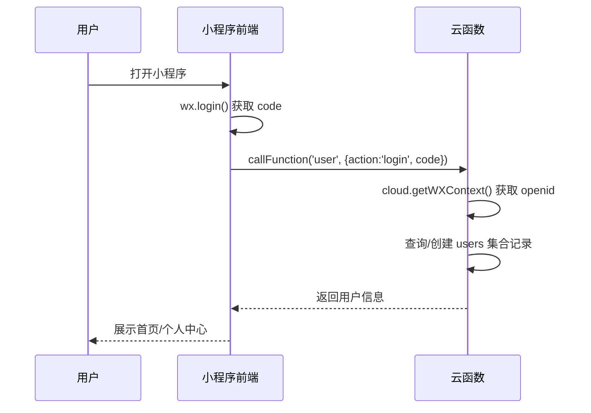
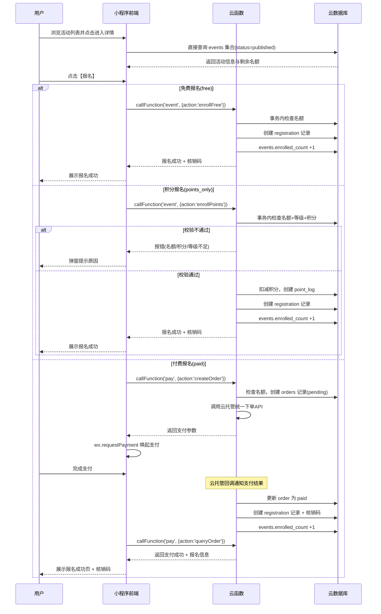
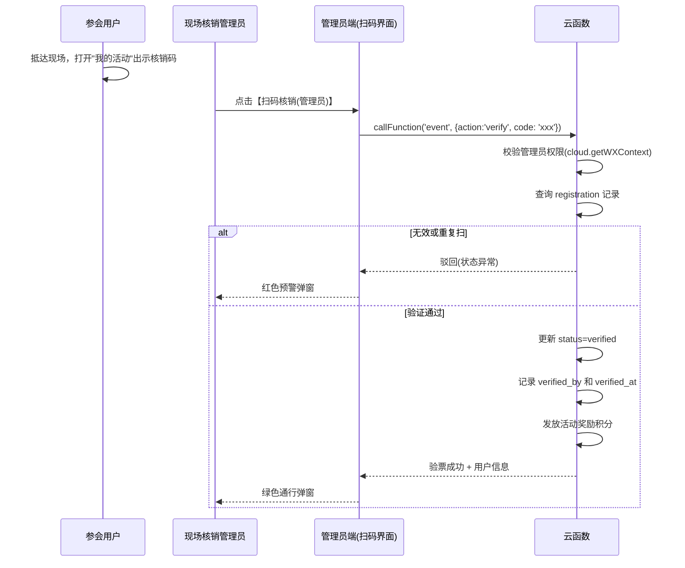
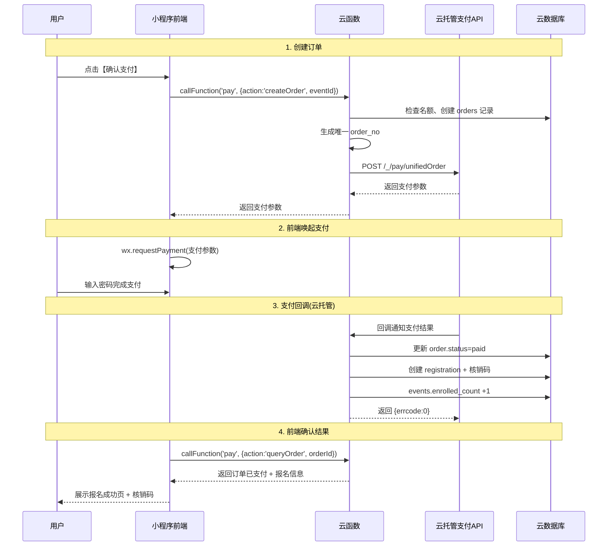
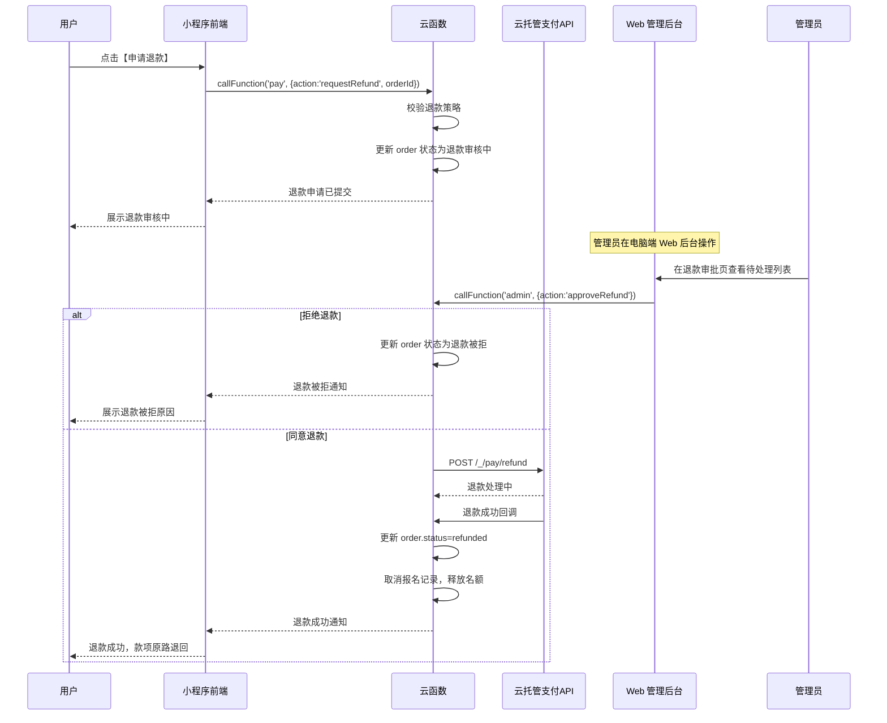

# 青翼读书会产品需求文档 (PRD)

---

## 文档版本

| 版本 | 创建日期 | 更新日期 | 变更说明 | 作者 |
|------|----------|----------|----------|------|
| v1.0 | 2026-04-08 | 2026-04-08 | 初始版本：纯积分报名模式 | -- |
| v2.0 | 2026-04-09 | 2026-04-09 | 新增微信支付报名、优化文档结构 | -- |
| v3.0 | 2026-04-09 | 2026-04-09 | 迁移至微信云开发架构 | -- |

---

## 产品概览

### 产品愿景

青翼读书会是一个以阅读活动为核心的社区平台，通过积分体系与付费活动并行运营，连接读者与优质内容，构建可持续的阅读生态。

---

## 目标用户画像

### 画像一：普通读者
- **特征**：偶尔参加活动，通过每日签到攒积分
- **诉求**：低门槛参与，用积分兑换活动名额
- **典型路径**：签到 -> 浏览活动 -> 积分报名 -> 线下参加

### 画像二：活跃会员
- **特征**：高频参与，重视会员等级晋升，积攒大量积分
- **诉求**：优先获得稀缺活动名额，等级带来的身份认同
- **典型路径**：每日签到 -> 积分活动报名 -> 完成活动获取奖励积分 -> 升级

### 画像三：付费参与者
- **特征**：愿意为高质量特邀活动（知名作家讲座、专题沙龙）直接付费
- **诉求**：便捷支付、清晰退款保障、优质活动体验
- **典型路径**：浏览活动 -> 付费报名 -> 微信支付 -> 线下参加

---

## 术语表

| 术语 | 说明 |
|------|------|
| 积分 | 平台虚拟货币，通过签到/活动获得，用于积分模式报名 |
| 会员等级 | 青铜/白银/黄金三级体系，基于累计积分自动晋升 |
| 核销码 | 报名成功后生成的二维码入场凭证 |
| 活动报名模式 | 活动的准入方式：free（免费）/ points_only（积分兑换）/ paid（付费报名） |
| 订单 | 付费报名时创建的支付记录 |
| 退款 | 取消付费活动报名并退还款项 |
| 云函数 | 微信云开发中运行的 Node.js 服务端代码，免鉴权 |
| 云数据库 | 微信云开发内置的文档型数据库 |
| 云调用 | 云函数内直接调用微信开放接口，免签名免证书 |

---

## 1. 总体架构规划

### 1.1 技术架构

```
┌─────────────────────────────────────────────────┐
│                微信原生小程序 (前端)               │
│  pages / components / utils / styles             │
└──────────┬──────────────┬──────────────┬─────────┘
           │              │              │
    callFunction()  database()    callContainer()
           │              │              │
┌──────────▼──────┐ ┌─────▼─────┐ ┌─────▼──────────┐
│    云函数        │ │ 云数据库   │ │ 云托管(支付)    │
│  user/event/    │ │ 7个集合    │ │ Express 服务    │
│  pay/admin      │ │ + 安全规则 │ │ 内置支付API     │
└─────────────────┘ └───────────┘ └────────────────┘
```

### 1.2 技术选型

| 层级 | 选型 | 说明 |
|------|------|------|
| 前端 | 原生小程序 (WXML/WXSS/JS) | 仅微信端，无需跨平台 |
| 服务端 | 云函数 (Node.js) | 免服务器，按量计费 |
| 数据库 | 云数据库 (文档型) | 内置，类 MongoDB |
| 支付 | 云托管 + 云调用 | 免签名、免证书、免 access_token |
| 存储 | 云存储 | 封面图、头像等文件 |

### 1.3 业务端划分

1. **用户端（C端）**：面向普通读者的微信小程序。
2. **管理端（B端）**：同一小程序内的管理页面（通过 role 字段控制权限入口），或独立管理端小程序。

---

## 2. 用户端功能需求

### 2.1 首页

首页作为平台的核心分发中枢，主要包含以下功能区块：

1. **顶部操作区**：具备全站活动搜索功能入口以及全局消息/通知（通知中心）入口。
2. **首页 Banner**：大视觉焦点图，点击可直接跳转至最重磅的读书会或特邀活动。
3. **快捷操作区（金刚区）**：
   - **每日签到**：核心引流/促活模块，视觉强化展示已累计签到天数，点击可弹出签到成功动效奖励。
   - **积分查询**：跳转至积分流水，查询积分入账与消耗明细。
   - **我的活动**：方便重度参与者快速切入已报名赛道（支持活动签到页）。
4. **热门活动**：动态展示当前热门或临期的读书活动，呈现时间、地点及付费/积分情况。列表规则：只展示时间临近的3个活动，其余活动均在活动列表页展示。
5. **好书推荐**：展示平台精选的高分（如9.5分、9.8分）实体书籍推荐位及封皮信息。
6. **全局底部导航**：固定展示四大核心模块：首页、活动、商城（规划预留）、我的。

### 2.2 活动大厅

活动聚合页采用双 Tab 导航结构，将"我的活动"与全量"活动列表"合并归档，并在交互上以"我的活动"为默认第一呈现。

1. **双 Tab 聚合页**：
   - **我的活动（默认展现）**：呈现用户个人参与的活动列表，展示已报名、待参加的活动集合。在后续核销流程中，将在此页为用户提供专属签到入场数字码（或二维码）。
   - **活动列表（次级视图）**：公开呈现平台所有的对外活动集合，包含分页加载，时间由近及远排序，已经到期结束的活动在下方用额外的样式展示，并提供查看详情的回顾按钮。

2. **活动详情页**：
   - 全屏沉浸式海报背景与渐变效果。展示图文介绍、主讲人、详细日程规划与活动场地地图引导。
   - **报名模式与底部留驻状态区**：根据 `registration_mode` 展示不同的价格阶梯或提示：
     - `free`："免费报名" 并直接进报名流程。
     - `points_only`："需 X 积分" 标签或提示项。
     - `paid`："20.00元" 等直接显示的付费标签与已报人数。
   - **底部动作按钮**：浮动固定的功能栏按钮，引导用户"立即报名"，报名成功后呈现弹窗，提示去对应的【我的】页面查找入场券。
   - **活动评论**：用户在报名后可以查看活动详情页的评论区并发表评论。

3. **支付订单确认页**（仅 `paid` 模式）：
   - 展示活动摘要及费用明细，限时 15 分钟内支付倒计时。
   - 调用 `wx.requestPayment` 发起微信支付。

### 2.3 好书推荐 (全新增强模块)

作为知识社区的重要一环，提供书籍阅览资料馆：

1. **统一图书长廊（图书总列表）**：
   - 图书的系统性呈现平铺或网格流视图，展现高分推荐与当季上新。
2. **图书详情页**：
   - 展现书籍的精美封面大图与评分机制。展示书名、作者、简介以及社区读者对该书籍内容的短平快相关评价。
   - 未来扩展规划：提供购书链接或衍生沙龙活动反向强绑定。

### 2.4 个人中心

1. **个人资料与数据看板**：
   - 顶部提供快速【编辑资料】的功能入口及账户头像与昵称。
   - 积分、会员等级与进度动态计算呈现。
2. **核心业务资产流向块**：
   - **订单记录库（我的订单）**：系统保留对 Paid Mode（付费报名/商城记录）产生的真实交易流水状态展示，包含"支付/退款"状态管理。
   - 其它快速入口包含：活动验证（管理员专属扫码页）、积分核销及活动跳转记录。
3. **管理员扫码页（权限显示）**：
   - 通过系统身份判断，单独剥离出专属 `event-verify` 扫码核销控制面板。

1. **个人资料卡片**：
   - 展示用户头像、用户昵称、会员号（唯一识别码）、当前会员等级徽章。
   - **积分与等级进度**：展示"当前可用积分"（例如 700 分），并动态提示"距离下一等级还需 X 分"，配合图形化的升级进度条。
2. **积分明细**：
   - 记录用户积分的增加（每日签到奖励、活动奖励）与扣减（积分活动报名消耗）历史流水。
3. **我的订单**：
   - 快捷入口，跳转至完整的订单列表页（详见 2.2 第 5 点）。
4. **管理员扫码（专有功能）**：
   - 若当前用户被系统赋予"活动管理员"权限，此页面将展示"扫码核销（管理员）"入口。点击后调用设备摄像头，扫描其他用户的"入场核销码"完成线下验票登记。

### 2.5 账号与设置

1. **身份认证**：新用户授权获取基础展示信息，绑定认证手机号码。
2. **资料编辑**：独立出完整的用户信息配置页面（头像、昵称、常用联系电话编辑功能）。
3. **安全退出**：退出当前账号登录状态（返回登录页 `login.html`）。

---

## 3. 管理端功能需求

管理端分为两个载体，各自承载最适合的操作场景：

### 管理端载体划分

| 载体 | 技术实现 | 负责功能 | 操作场景 |
|------|---------|---------|---------|
| **Web 管理后台** | Vue3 + Element Plus，部署在云开发静态托管 | 用户管理、积分调整、活动管理、订单管理、退款审批、内容管理、财务看板 | 电脑端，日常运营 |
| **小程序端** | 小程序内 `/pages/verify/` 页面 | 管理员扫码核销 | 手机端，线下活动现场 |

Web 后台通过 `@cloudbase/js-sdk` 接入云开发，与小程序共享同一个云开发环境（数据库、云函数、存储）。
Web 后台登录使用云开发邮箱密码鉴权，管理员账号在云开发控制台预先创建。

---

以下为各管理功能模块的详细需求：

### 3.1 用户管理

- **用户信息查询**：按会员号、手机号、注册时间、当前等级进行用户筛选。
- **用户资产维护**：针对客诉或特殊活动，支持运营人员手工**增加/扣减积分**，或直接**调整用户会员等级**。
- **管理权限分配**：分配系统运营角色，特别是可以针对线下员工账号发放**"现场核销员"**专属身份。

### 3.2 活动管理

- **活动发布编辑**：
  - 富文本编辑器支持上传长图、主副标题、活动分类（如：读书会、特邀沙龙）。
  - **活动限制配置**：设置报名起止时间、活动具体时间、活动报名人数上限。
  - **活动报名模式与门槛配置**：

    | 配置字段 | 类型 | 适用模式 | 说明 |
    |---------|------|---------|------|
    | registration_mode | enum | 全部 | `free` / `points_only` / `paid` |
    | points_cost | integer | points_only | 报名所需扣减的积分数量 |
    | tier_threshold | enum | points_only | 等级门槛：none / bronze / silver / gold |
    | price_yuan | decimal | paid | 报名费（单位：元） |
    | refund_policy | enum | paid | 退款策略：no_refund / full_refund_before_X_hours / custom |

- **报名名单追踪**：
  - 实时查看某活动下的已报名用户名单、积分扣减状态或支付状态。支持名单导出为 Excel 进行离线备份。
- **活动核销记录**：
  - 统计单次活动的实际出勤率（签到人数/报名人数）。记录每一位用户的核销日志（被哪位现场管理员、在什么时间扫码核准）。
- **支付记录管理**（仅 `paid` 模式活动）：
  - 按活动、日期范围、支付状态筛选支付记录
  - 展示：订单号、用户、金额、支付时间、状态（已支付/已退款）
  - 支持导出
- **退款管理**（仅 `paid` 模式活动）：
  - 查看待处理退款申请
  - 管理员审批：同意或拒绝退款
  - 通过云函数调用退款 API 执行退款
  - 退款审计日志

### 3.3 积分与等级管理

为保障 C 端展示逻辑统一，必须在管理端配置统一的积分与等级跃迁规则：

- **积分增加与消耗规则设置**：
  - *基础获取*：设置"每日签到基础得分"（如每次 +10 积分），可设置连签额外奖励分。
  - *活动获取/消耗*：可在"活动管理"中为各个 `points_only` 模式活动单独设定报名所需的扣减积分，也可设定参与后作为奖励的下发积分。
- **会员等级跃迁规则设置**：
  - 统一定义等级体系阈值：
    - **青铜会员**：0 - 499 专属积分
    - **白银会员**：500 - 999 专属积分
    - **黄金会员**：1000+ 专属积分
  - 系统应自动比对用户累计总积分，匹配其到达的等级并实时在"个人中心"的升级进度条中计算差值。

### 3.4 内容管理

- **推荐阅读管理**：配置用户端首页展示的"好书推荐"。支持上传书籍封面，维护书名、简要引言。
- **首页轮播配置**：管理主页顶部焦点图的替换、链接配置及下架操作。

### 3.5 财务看板

- **收入概览**：按周/月展示总收入，按活动分类统计
- **支付流水**：展示所有微信支付交易记录，含退款明细
- **退款率追踪**：按活动统计退款率，辅助运营决策
- **对账功能**：将微信支付平台记录与本地订单进行日结对账

---

## 4. 核心业务流程

### 4.1 用户注册与认证流程



### 4.2 活动报名流程



### 4.3 扫码核销流程



### 4.4 每日签到与积分等级更新流程

1. **发起行为（前端）**：用户在**首页**点击"每日签到"入口。
2. **逻辑核算（云函数）**：`callFunction('user', {action:'signIn'})`，防重复签到（校验 `last_sign_date`），增加积分并生成 `point_logs` 记录。
3. **等级判定（云函数）**：积分增加后，重新测算累计积分是否触发等级跃迁，自动更新 `level` 字段。
4. **实时反馈（前端）**：展示获得积分的动效，刷新积分和等级进度条。

### 4.5 支付与订单流程（云开发版）



**支付边界处理**：
- **支付超时**：订单创建后 15 分钟未支付，云函数定时触发器自动关闭订单，释放名额
- **支付失败**：前端展示失败原因，提供"重新支付"按钮
- **重复支付**：基于 `order_no` 幂等校验，防止同一订单多次扣款
- **回调丢失**：云函数定时触发器每 5 分钟查询未确认订单，补偿处理

### 4.6 退款流程



---

## 5. 非功能性需求

### 5.1 并发响应能力

名额有限的稀缺活动可能诱发抢票行为，报名、积分扣减、订单创建等核心并发接口在云函数中使用 `db.runTransaction()` 事务处理。

### 5.2 多端状态一致性

要求所有页面间对"当前积分"、"剩余名额"的展示无缝贴合一致，特别是在弱网线下核销签到场景保障用户体验。

### 5.3 统一设计规范

用户端全方位执行 "Tehran" 首版设计规范体系：基于 Teal（绿青色 `#14b8a6`）作为主品牌识别色，采取大留白、轻量圆角和毛玻璃微动效（Minimalist & Glassmorphism）。
管理端遵循高效扁平的组件库形态，保证管理后台操作路径清晰明了。

### 5.4 支付安全

- 微信支付通过云调用处理，**无需管理证书和签名**
- 金额在后端（云函数）校验，**绝不信任前端传入的金额**
- 订单号（order_no）必须全局唯一且幂等
- 支付超时处理：云函数定时触发器每分钟扫描超时订单（15分钟未支付自动关闭）
- 回调处理必须幂等（微信可能发送重复回调）

### 5.5 合规要求

- 微信小程序支付需要：企业主体认证（非个人）、微信支付商户号绑定、ICP 备案
- 退款政策必须在用户支付前明确展示
- 订单和支付记录必须至少保留 5 年（中国财务记录保留要求）
- 不存储用户原始支付凭据，仅保留交易 ID
- 微信支付手续费（通常 0.6%）计入运营成本

### 5.6 数据一致性

- 订单创建和支付回调处理在云函数事务中保证原子性
- 支付回调处理必须幂等（微信可能发送重复回调）
- 活动名额在支付确认时扣减（非下单时），防止未支付订单占用名额
- 云函数定时触发器执行对账：每5分钟补偿未收到回调的订单

### 5.7 错误处理与边界情况

- **支付期间网络中断**：前端展示"查询支付结果"按钮，轮询云函数确认支付状态
- **回调丢失**：云函数定时触发器补偿未收到回调的订单
- **重复支付**：通过 user_id + event_id 的组合唯一约束拦截
- **活动取消**：管理员操作触发批量退款云函数

### 5.8 云函数接口设计约定

云函数同时服务小程序端和 Web 管理后台，调用方式统一：

**小程序端调用：**
```javascript
wx.cloud.callFunction({
  name: '函数名',
  data: { action: '操作名', ...参数 }
})
```

**Web 管理后台调用：**
```javascript
app.callFunction({
  name: '函数名',
  data: { action: '操作名', ...参数 }
})
```

返回格式统一: `{ success: boolean, data: any, message: string }`

**云函数与 action 映射表**：

| 云函数 | action | 调用方 | 说明 |
|--------|--------|--------|------|
| user | login | 小程序 | 登录/注册 |
| user | signIn | 小程序 | 每日签到 |
| user | getProfile | 小程序 | 获取个人信息 |
| user | updateProfile | 小程序 | 更新个人信息 |
| user | getPointLogs | 小程序 | 积分明细列表 |
| event | list | 小程序 | 活动列表(分页) |
| event | detail | 小程序 | 活动详情 |
| event | enrollFree | 小程序 | 免费报名 |
| event | enrollPoints | 小程序 | 积分报名 |
| event | myEvents | 小程序 | 我的活动列表 |
| event | verify | 小程序 | 扫码核销(管理员) |
| pay | createOrder | 小程序 | 创建订单+统一下单 |
| pay | queryOrder | 小程序 | 查询订单状态 |
| pay | cancelOrder | 小程序 | 取消未支付订单 |
| pay | requestRefund | 小程序 | 申请退款 |
| pay | refundCallback | 云托管 | 退款回调处理 |
| admin | getUsers | Web后台 | 用户列表/搜索/筛选 |
| admin | adjustPoints | Web后台 | 调整积分(含事务) |
| admin | manageEvent | Web后台 | 活动增删改 |
| admin | getOrders | Web后台 | 订单列表/筛选/导出 |
| admin | approveRefund | Web后台 | 退款审批 |
| admin | getRegistrations | Web后台 | 报名名单/核销记录 |
| admin | manageContent | Web后台 | 轮播/推荐管理 |
| admin | getDashboard | Web后台 | 财务看板数据 |

**云函数权限校验**：
- 小程序端云函数通过 `cloud.getWXContext()` 获取 openid 鉴权
- Web 后台云函数（admin）需额外校验管理员身份：维护管理员邮箱白名单，Web 端登录后传入身份信息，云函数内比对验证
