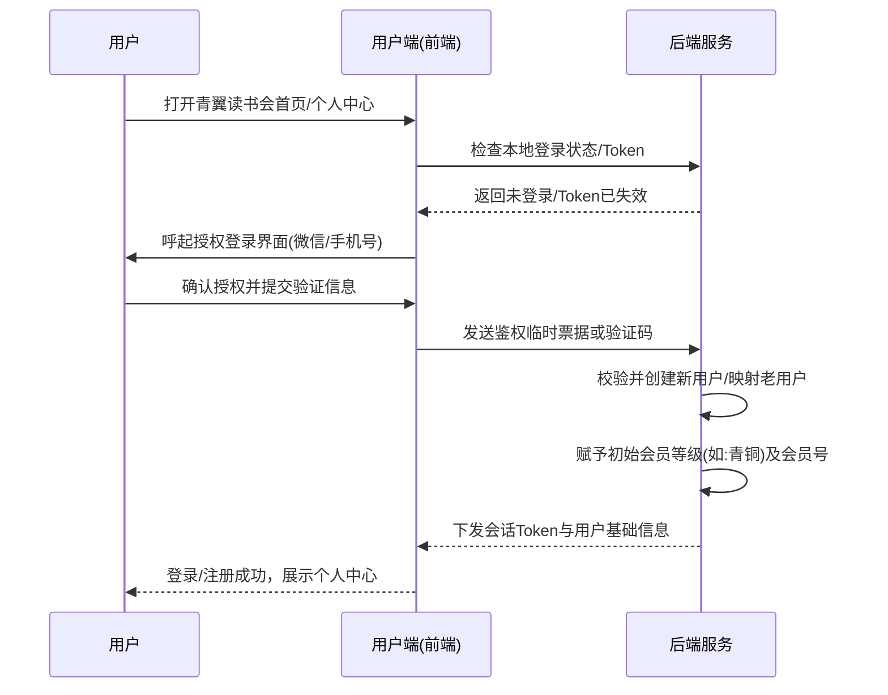
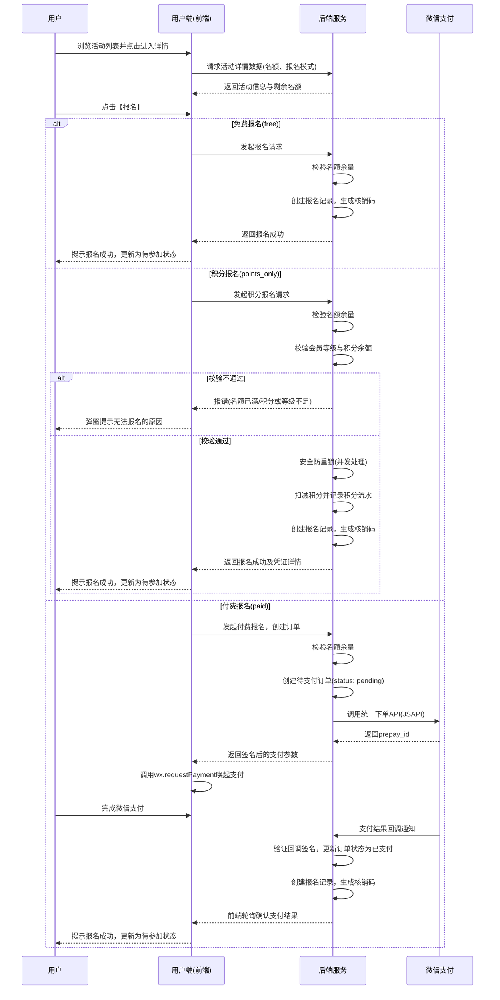
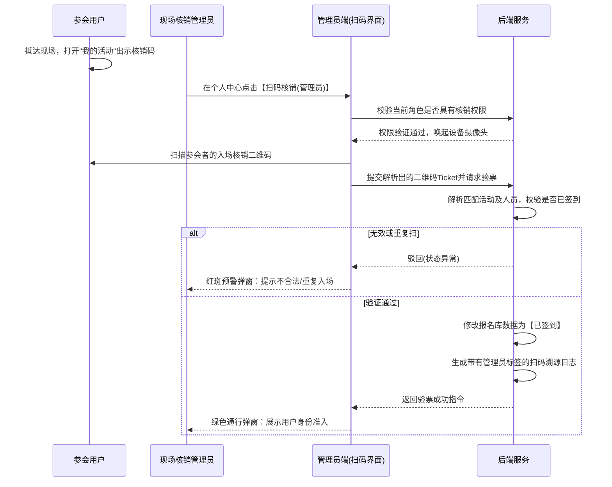
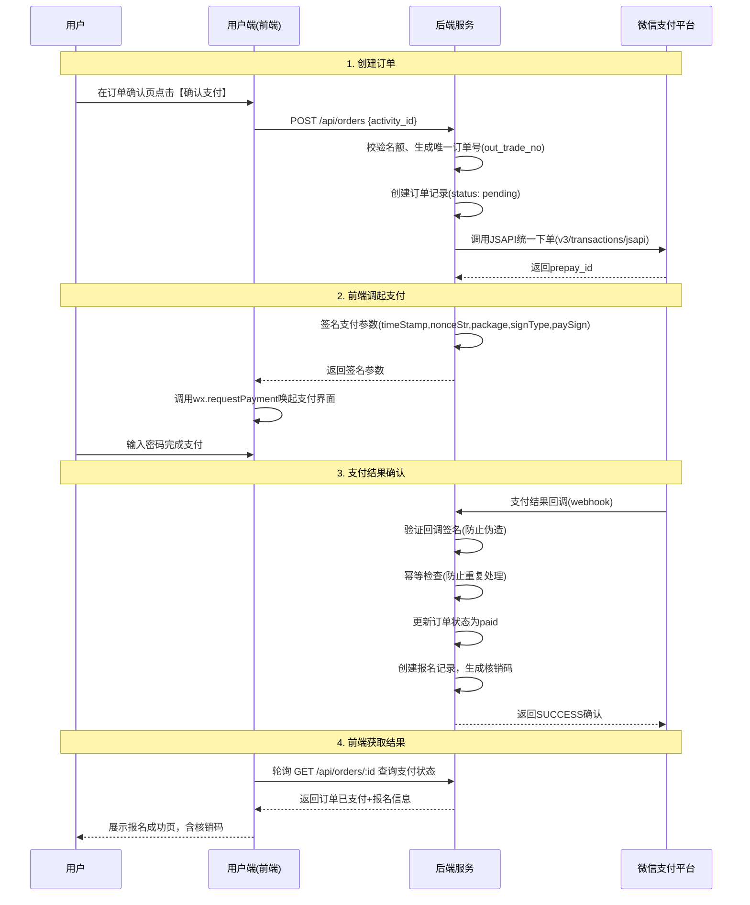
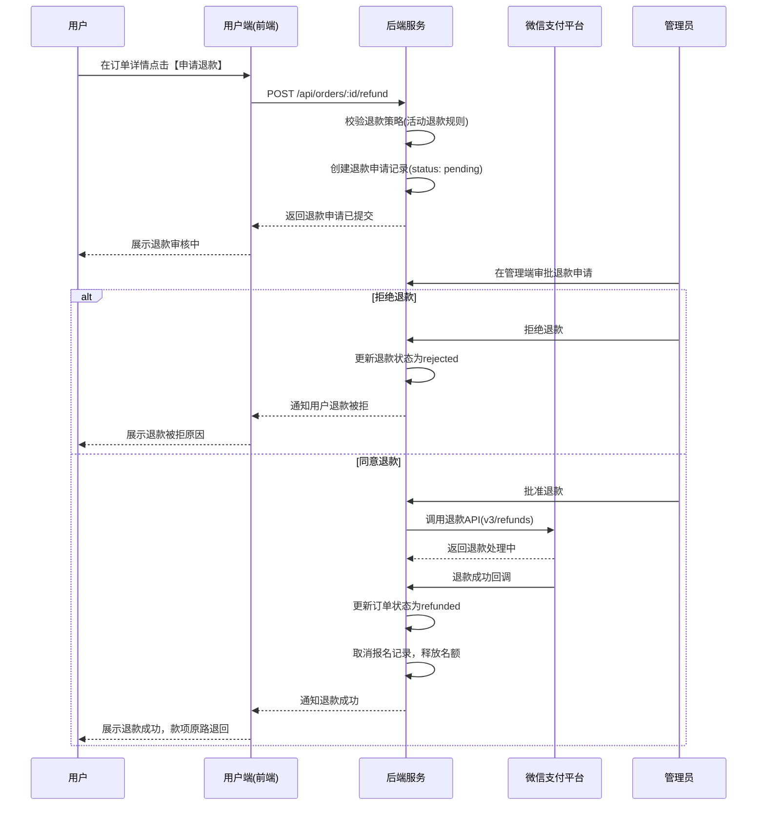

# 青翼读书会产品需求文档 (PRD)

---

## 文档版本

| 版本 | 创建日期 | 更新日期 | 变更说明 | 作者 |
|------|----------|----------|----------|------|
| v1.0 | 2026-04-08 | 2026-04-08 | 初始版本：纯积分报名模式 | -- |
| v2.0 | 2026-04-09 | 2026-04-09 | 新增微信支付报名、优化文档结构 | -- |

---

## 产品概览

### 产品愿景

青翼读书会是一个以阅读活动为核心的社区平台，通过积分体系与付费活动并行运营，连接读者与优质内容，构建可持续的阅读生态。

### 产品目标

1. **用户增长**：3 个月内达到 1,000 名注册用户
2. **活动运营**：月均 4+ 场活动，覆盖免费、积分、付费三种模式
3. **用户留存**：30 日留存率 > 40%
4. **付费转化**：付费活动报名转化率 > 15%

### 成功指标

| 指标 | 定义 | 目标值 |
|------|------|--------|
| DAU | 日活跃用户数 | 200+ |
| 活动参与率 | 报名人数/活动名额 | > 80% |
| 签到率 | 实际签到/已报名 | > 70% |
| 付费转化率 | 付费报名/活动页访问 | > 15% |
| ARPU | 每用户平均收入（含积分价值） | 持续增长 |

---

## 目标用户画像

### 画像一：普通读者
- **特征**：偶尔参加活动，通过每日签到攒积分
- **诉求**：低门槛参与，用积分兑换活动名额
- **典型路径**：签到 -> 浏览活动 -> 积分报名 -> 线下参加

### 画像二：活跃会员
- **特征**：高频参与，重视会员等级晋升，积攒大量积分
- **诉求**：优先获得稀缺活动名额，等级带来的身份认同
- **典型路径**：每日签到 -> 积分活动报名 -> 完成活动获取奖励积分 -> 升级

### 画像三：付费参与者
- **特征**：愿意为高质量特邀活动（知名作家讲座、专题沙龙）直接付费
- **诉求**：便捷支付、清晰退款保障、优质活动体验
- **典型路径**：浏览活动 -> 付费报名 -> 微信支付 -> 线下参加

---

## 术语表

| 术语 | 说明 |
|------|------|
| 积分 | 平台虚拟货币，通过签到/活动获得，用于积分模式报名 |
| 会员等级 | 青铜/白银/黄金三级体系，基于累计积分自动晋升 |
| 核销码 | 报名成功后生成的二维码入场凭证 |
| 活动报名模式 | 活动的准入方式：free（免费）/ points_only（积分兑换）/ paid（付费报名） |
| 订单 | 付费报名时创建的支付记录 |
| 退款 | 取消付费活动报名并退还款项 |

---

## 1. 总体架构规划

本产品包含两大主要业务端，前后端功能命名保持高度对应与一致：
1. **用户端（C端）**：面向普通读者的微信小程序。
2. **管理端（B端）**：面向运营人员和现场核销人员的后台管理系统。

---

## 2. 用户端功能需求

### 2.1 首页

首页作为平台的核心分发中枢，主要包含以下功能区块：

1. **用户状态栏**：展示用户当前的会员等级（如"白银会员"）。
2. **核心焦点推荐**：首屏展示最新、最重磅的读书会活动或核心会员特权信息。
3. **常用功能入口（金刚区）**：
   - **每日签到**：点击获取每日积分奖励，积分规则由管理端统一定义。
   - **扫码核销**：非管理员点击提示无权限，线下活动使用。
   - **我的积分**：点击跳转至完整的积分流水页面。
4. **近期活动**：按照时间维度（当周活动、下周活动）展示，包含活动标签、活动标题、时间、地点。
5. **好书推荐**：以横向滑动的方式展示平台推荐的实体书籍及其作者信息（点击后显示：功能开发中，敬请期待..）。
6. **全局底部导航**：分为"首页"、"活动"、"商城（规划中）"、"我的"。

### 2.2 活动

提供多维度的活动展示与报名预约功能。

1. **活动大厅**：分页或列表形式呈现平台内所有的对外活动。

2. **活动详情**：
   - 展示图文介绍、特邀嘉宾、详细日程安排、活动场地地址及地图引导。
   - **报名模式展示**：根据活动的 `registration_mode` 展示不同的准入信息：
     - `free`：显示"免费报名"
     - `points_only`：显示"需 X 积分"及会员等级门槛
     - `paid`：显示"报名费 Y 元"
   - **报名按钮逻辑**：
     - `free`：按钮文案"免费报名"，点击直接进入报名流程
     - `points_only`：按钮文案"立即报名 . X 积分"，前置校验会员等级与积分余额
     - `paid`：按钮文案"立即报名 . Y 元"，进入支付订单确认页
   - **往期回顾**：对于已结束的活动，展示现场精华照片、活动回顾总结，报名按钮转为"查看回顾"状态。

3. **支付订单确认页**（仅 `paid` 模式）：
   - 展示活动摘要（标题、时间、地点）
   - 展示价格明细（报名费）
   - 订单倒计时（15 分钟内完成支付）
   - "确认支付"按钮，调用 `wx.requestPayment` 发起微信支付
   - 支付成功后自动跳转至报名成功页

4. **我的活动**：
   - 查看用户参与的全部活动状态（待参加、已取消、已完成）。
   - **入场核销码**：为报名成功的活动提供专属二维码及数字串码，供线下展示与管理员扫码验票。

5. **我的订单**：
   - 按状态筛选订单：待支付 / 已支付 / 已取消 / 已退款
   - 每个订单展示：活动标题、支付金额、订单时间、状态
   - 待支付订单可操作："去支付"（若未超时）或"取消订单"
   - 已支付订单可操作："申请退款"（若活动退款政策允许）

### 2.3 个人中心

1. **个人资料卡片**：
   - 展示用户头像、用户昵称、会员号（唯一识别码）、当前会员等级徽章。
   - **积分与等级进度**：展示"当前可用积分"（例如 700 分），并动态提示"距离下一等级还需 X 分"，配合图形化的升级进度条。
2. **积分明细**：
   - 记录用户积分的增加（每日签到奖励、活动奖励）与扣减（积分活动报名消耗）历史流水。
3. **我的订单**：
   - 快捷入口，跳转至完整的订单列表页（详见 2.2 第 5 点）。
4. **管理员扫码（专有功能）**：
   - 若当前用户被系统赋予"活动管理员"权限，此页面将展示"扫码核销（管理员）"入口。点击后调用设备摄像头，扫描其他用户的"入场核销码"完成线下验票登记。

### 2.4 账号与设置

1. **身份认证**：新用户授权获取基础展示信息，绑定认证手机号码。
2. **资料编辑**：支持用户自主修改系统头像、编辑用户昵称信息。
3. **安全退出**：退出当前账号登录状态。

---

## 3. 管理端功能需求

为了支撑用户端所有展示和闭环操作流，管理端须配套以下相应的管控能力：

### 3.1 用户管理

- **用户信息查询**：按会员号、手机号、注册时间、当前等级进行用户筛选。
- **用户资产维护**：针对客诉或特殊活动，支持运营人员手工**增加/扣减积分**，或直接**调整用户会员等级**。
- **管理权限分配**：分配系统运营角色，特别是可以针对线下员工账号发放**"现场核销员"**专属身份。

### 3.2 活动管理

- **活动发布编辑**：
  - 富文本编辑器支持上传长图、主副标题、活动分类（如：读书会、特邀沙龙）。
  - **活动限制配置**：设置报名起止时间、活动具体时间、活动报名人数上限。
  - **活动报名模式与门槛配置**：

    | 配置字段 | 类型 | 适用模式 | 说明 |
    |---------|------|---------|------|
    | registration_mode | enum | 全部 | `free` / `points_only` / `paid` |
    | points_cost | integer | points_only | 报名所需扣减的积分数量 |
    | tier_threshold | enum | points_only | 等级门槛：none / bronze / silver / gold |
    | price_yuan | decimal | paid | 报名费（单位：元） |
    | refund_policy | enum | paid | 退款策略：no_refund / full_refund_before_X_hours / custom |

- **报名名单追踪**：
  - 实时查看某活动下的已报名用户名单、积分扣减状态或支付状态。支持名单导出为 Excel 进行离线备份。
- **活动核销记录**：
  - 统计单次活动的实际出勤率（签到人数/报名人数）。记录每一位用户的核销日志（被哪位现场管理员、在什么时间扫码核准）。
- **支付记录管理**（仅 `paid` 模式活动）：
  - 按活动、日期范围、支付状态筛选支付记录
  - 展示：订单号、用户、金额、支付时间、状态（已支付/已退款）
  - 支持导出
- **退款管理**（仅 `paid` 模式活动）：
  - 查看待处理退款申请
  - 管理员审批：同意或拒绝退款
  - 调用微信退款 API 执行退款
  - 退款审计日志

### 3.3 积分与等级管理

为保障 C 端展示逻辑统一，必须在管理端配置统一的积分与等级跃迁规则：

- **积分增加与消耗规则设置**：
  - *基础获取*：设置"每日签到基础得分"（如每次 +10 积分），可设置连签额外奖励分。
  - *活动获取/消耗*：可在"活动管理"中为各个 `points_only` 模式活动单独设定报名所需的扣减积分，也可设定参与后作为奖励的下发积分。
- **会员等级跃迁规则设置**：
  - 统一定义等级体系阈值：
    - **青铜会员**：0 - 499 专属积分
    - **白银会员**：500 - 999 专属积分
    - **黄金会员**：1000+ 专属积分
  - 系统应自动比对用户累计总积分，匹配其到达的等级并实时在"个人中心"的升级进度条中计算差值。

### 3.4 内容管理

- **推荐阅读管理**：配置用户端首页展示的"好书推荐"。支持上传书籍封面，维护书名、简要引言。
- **首页轮播配置**：管理主页顶部焦点图的替换、链接配置及下架操作。

### 3.5 财务看板

- **收入概览**：按周/月展示总收入，按活动分类统计
- **支付流水**：展示所有微信支付交易记录，含退款明细
- **退款率追踪**：按活动统计退款率，辅助运营决策
- **对账功能**：将微信支付平台记录与本地订单进行日结对账

---

## 4. 核心业务流程

### 4.1 用户注册与认证流程

### 4.2 活动报名流程

### 4.3 扫码核销流程

### 4.4 每日签到与积分等级更新流程

1. **发起行为（前端）**：用户在**首页**点击"每日签到"入口。
2. **逻辑核算（后端）**：后端防多端重复点击校验，核准后依照**积分与等级管理**中设定的每日签到得分值增加用户的账面积分。
3. **等级判定（后端）**：积分增加后，重新测算累计积分是否触发了新一层级的会员门槛（如 495分 + 10分签到 = 505分），触发则直接完成升级。
4. **实时反馈（前端）**：前端展示获得积分的动效，并重绘**个人中心**内的积分卡片数值与等级进度条。

### 4.5 支付与订单流程

**支付边界处理**：
- **支付超时**：订单创建后 15 分钟未支付，系统自动关闭订单，释放名额
- **支付失败**：前端展示失败原因，提供"重新支付"按钮
- **重复支付**：基于 `out_trade_no` 幂等校验，防止同一订单多次扣款
- **回调丢失**：后端每 5 分钟主动查询微信支付 API，补偿未收到回调的订单

### 4.6 退款流程

---

## 5. 非功能性需求

### 5.1 并发响应能力

名额有限的稀缺活动可能诱发抢票行为，报名、积分扣减、订单创建等核心并发接口必须进行对应的库存锁操作并发防重设计。

### 5.2 多端状态一致性

要求所有页面间对"当前积分"、"剩余名额"的展示无缝贴合一致，特别是在弱网线下核销签到场景保障用户体验。

### 5.3 统一设计规范

用户端界面遵循已设计原型的视觉风格；管理端遵循高效扁平的组件库形态，保证管理后台操作路径清晰明了。

### 5.4 支付安全

- 所有支付回调必须验证微信签名，防止伪造通知
- 订单号（out_trade_no）必须全局唯一且幂等
- 支付金额必须在后端校验（绝不信任前端传入的金额）
- 微信支付 API 密钥存储在 `.env` 文件中，绝不暴露给前端
- 支付超时处理：订单 15 分钟未支付自动关闭，释放活动名额

### 5.5 合规要求

- 微信小程序支付需要：企业主体认证（非个人）、微信支付商户号绑定、ICP 备案
- 退款政策必须在用户支付前明确展示
- 订单和支付记录必须至少保留 5 年（中国财务记录保留要求）
- 不存储用户原始支付凭据，仅保留交易 ID
- 微信支付手续费（通常 0.6%）计入运营成本

### 5.6 数据一致性

- 订单创建和支付回调处理必须保证原子性
- 支付回调处理必须幂等（微信可能发送重复回调）
- 活动名额在支付确认时扣减（非下单时），防止未支付订单占用名额
- 每日定时对账任务：将微信支付平台记录与本地订单进行比对

### 5.7 错误处理与边界情况

- **支付期间网络中断**：前端展示"查询支付结果"按钮，轮询后端确认支付状态
- **回调丢失**：后端每 5 分钟主动查询微信支付 API 补偿未收到回调的订单
- **重复支付**：通过用户+活动的唯一约束拦截
- **活动取消**：自动触发所有付费参与者的批量退款流程

### 5.8 API 设计约定

所有接口统一返回 JSON 格式：`{ success: boolean, data: any, message: string }`。

支付相关接口：

| 接口 | 方法 | 说明 |
|------|------|------|
| /api/orders | POST | 创建订单并获取微信支付参数 |
| /api/orders | GET | 查询用户订单列表（分页） |
| /api/orders/:id | GET | 查询订单详情及支付状态 |
| /api/orders/:id/cancel | POST | 取消未支付订单 |
| /api/orders/:id/refund | POST | 申请退款 |
| /api/payment/wechat/callback | POST | 微信支付结果回调（无需鉴权） |
